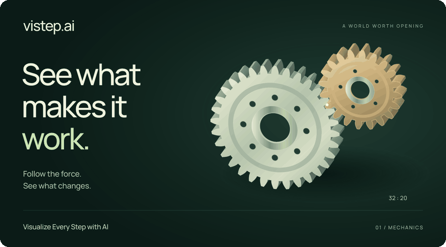

<div align="center">

# vistep.ai

**Visualize Every Step with AI**

先看懂原理，再亲手验证。

[开始探索](https://vistep.ai/zh/) · [文档](docs/zh-CN/README.md) · [参与贡献](docs/zh-CN/contributing.md) · [English](README.md)

[](https://github.com/int64ago/vistep/actions/workflows/ci.yml)
[](LICENSE)
[](https://astro.build)
[](tsconfig.json)
[](docs/zh-CN/deployment.md)
[](docs/zh-CN/localization-and-seo.md)

[](https://vistep.ai/zh/)

[查看静态画面](docs/media/vistep-showcase-poster.png)

</div>

vistep.ai 用短篇视觉故事讲解生活器物、科学与计算。跟随一个部件、一束信号或一次运算，看见中间过程，再改变输入，验证自己的理解。

- **先观看，再探索。** 按章节自动演示，支持暂停、重播、定位与按需展开的实验。
- **计算驱动画面。** 独立模型连接几何、运动与读数，正文说明教学简化并引用资料。
- **找到感兴趣的内容。** 中英文关键词搜索，结合兴趣分类、时长与建议起看年龄筛选。
- **中英双语。** 分别撰写的讲解、字幕与文字稿。实验在浏览器内运行，无需账号、API 密钥或实时 AI 服务。

**本次发布：** 合集扩展至 **62 篇**，正式站通过 `main` 的 [GitHub Actions](https://github.com/int64ago/vistep/actions/workflows/ci.yml?query=branch%3Amain) 发布。[发布与审看记录](docs/zh-CN/expansion-50.md)分别说明交付状态，以及尚未覆盖全部专题的完整观看、原生试听和真机检查。

## 开始探索

| 生活器物                                            | 信息与计算                                                 | 空间与系统                                        |
| --------------------------------------------------- | ---------------------------------------------------------- | ------------------------------------------------- |
| [自行车变速](https://vistep.ai/explore/bicycle/)    | [JPEG 压缩](https://vistep.ai/explore/jpeg/)               | [多维空间](https://vistep.ai/explore/dimensions/) |
| [冰箱制冷](https://vistep.ai/explore/refrigerator/) | [大模型训练与生成](https://vistep.ai/explore/transformer/) | [钟摆](https://vistep.ai/explore/pendulum/)       |
| [激光打印机](https://vistep.ai/explore/printer/)    | [网页加载](https://vistep.ai/explore/network/)             | [电梯调度](https://vistep.ai/explore/elevator/)   |

[完整源码目录](docs/zh-CN/catalog.md)

## 本地运行

使用 [Node.js 24](.nvmrc) 与 pnpm 11.25.0。站点支持 Chrome 111、Edge 111、Firefox 121、Safari 16.4 及以上，更旧的浏览器只会看到提示而非实验。配音录音存放在 [Git LFS](https://git-lfs.com/)，克隆前先安装。

```sh
git lfs install
git clone https://github.com/int64ago/vistep.git
cd vistep
corepack enable
pnpm install --frozen-lockfile
pnpm dev
```

打开 [localhost:4321](http://127.0.0.1:4321/)。录音已包含在仓库中，本地开发无需 Cloudflare 凭据或语音服务。

| 命令                 | 用途                                           |
| -------------------- | ---------------------------------------------- |
| `pnpm verify`        | 格式、文档链接、类型、测试、生产构建与产物审计 |
| `pnpm build:preview` | 独立预览构建与 noindex 检查                    |
| `pnpm preview`       | 本地查看生产构建                               |
| `pnpm scene:check`   | 专题、双语内容与音频契约                       |

Astro 预生成文章，React 实验通过 TypeScript 模型驱动 SVG、Canvas 或 Three.js。动画与录音共用章节时钟。详见[架构](docs/zh-CN/architecture.md)、[语言与 SEO](docs/zh-CN/localization-and-seo.md)和[部署](docs/zh-CN/deployment.md)。

## 参与贡献

欢迎科学纠错、新专题、翻译与无障碍改进。可按[制作手册](docs/zh-CN/creating-a-scene.md)推进，也可向 [vistep-scene 技能](.agents/skills/vistep-scene/SKILL.md)直接描述“解释感应电机为什么会转”。[检查记录](docs/zh-CN/README.md#检查记录)分别说明自动测试、浏览器观察与试听证据。

[贡献指南](docs/zh-CN/contributing.md) · [行为准则](docs/zh-CN/code-of-conduct.md) · [私下报告安全问题](docs/zh-CN/security.md)

原创代码与文档采用 [MIT 许可证](LICENSE)。字体、依赖与语音来源见[第三方说明](docs/zh-CN/third-party-notices.md)。
