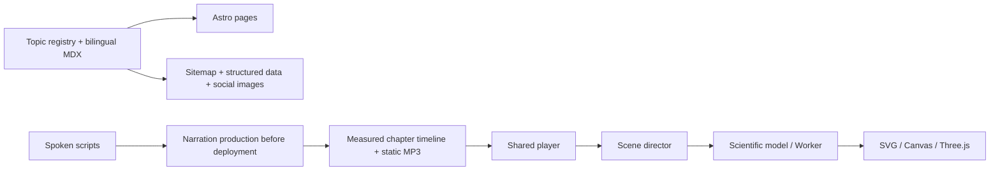

# Architecture

[简体中文](zh-CN/architecture.md) · [Documentation](README.md)

vistep is a static website with client-side experiments. There is no visitor account system, application backend or live AI inference service. Articles and transcripts remain readable without JavaScript.

## Data flow

## Responsibilities

| Location                                                          | Responsibility                                                                                                          |
| ----------------------------------------------------------------- | ----------------------------------------------------------------------------------------------------------------------- |
| `src/data/topics.ts`                                              | Topic identity, descriptions, related topics and technical sources                                                      |
| `src/content/`, `src/content/en/`                                 | Prerendered MDX articles                                                                                                |
| `src/data/discovery-metadata.ts`                                  | Six interest categories, editorial starting ages and bilingual search aliases                                           |
| `src/components/DiscoveryCatalog.astro`, `src/lib/discovery.ts`   | Static complete catalog, progressive search/filtering, URL state and return-position recovery                           |
| `src/data/experiments.ts`                                         | Explicit dynamic imports; keeps experiment engines off the homepage                                                     |
| `src/i18n/english.ts`, `src/components/english/`                  | Registers the English dictionary; only English islands and the server import it, so Chinese pages never download it     |
| `src/components/covers/`, `TopicCover.astro`, `ObjectCover.astro` | Scene artwork shared by catalog, homepage fallback and social compositions; entry points choose the appropriate framing |
| `src/components/CoverArt.astro`, `src/lib/svg-cover.ts`           | Rounds served cover geometry to sub-pixel precision; raster covers are encoded with `src/lib/png.ts`                    |
| `src/data/narration.json`                                         | Bilingual chapter writing and production timing                                                                         |
| `src/data/film-timeline.json`, `audio-tracks.json`                | Compact client playback metadata, generated with recordings                                                             |
| `src/data/audio-manifest.json`                                    | Full recording provenance and measured cue boundaries                                                                   |
| `src/components/lab/Showcase.tsx`                                 | Playback, seeking, chapters, visibility and exploration mode                                                            |
| `src/components/experiments/`                                     | Independent scene compositions and chapter directors                                                                    |
| `src/components/three/`                                           | Procedural geometry, cameras, materials and 2D alternatives                                                             |
| `src/models/`, `src/workers/`                                     | Testable calculations and expensive background work                                                                     |
| `src/i18n/`, `src/data/seo.ts`                                    | Language negotiation, translations and search metadata                                                                  |
| `src/pages/social/`                                               | Social PNGs generated from the existing cover artwork                                                                   |

`drafts/` is an optional workspace created by `pnpm scene:new`; it is not a prerequisite for scene production and does not generate public routes. Complete registration and content integration are still required. See the [production guide](creating-a-scene.md).

## Time and lifecycle

Narration defaults on and makes audio time authoritative; buffering pauses visual progress. A manual sound choice persists in local storage, with compatibility for the earlier session preference. If storage is unavailable, the initial preference remains on. When the browser refuses autoplay, a prominent offer appears on the stage to start the voice from the current moment; the silent film keeps running, and dismissing the offer leaves a quiet status line. Recording failures leave the silent film running with a retry control. Its shared clock advances without sound. Playback pauses offscreen and in background tabs. Explicit language routes never silently change language. See [language selection](localization-and-seo.md).

Directors use chapter-relative progress, not hard-coded positions in an old short film. Measured narration windows can change without breaking shot selection. Seeking rebuilds history-dependent simulations with fixed time steps. The teaching Transformer reconstructs the requested training step in its Worker and freezes weights during generation.

Three.js scenes dispose geometries, materials, textures, controls and renderers. Workers terminate and audio resources release on unmount. Frame scheduling targets are ceilings, not measured performance guarantees; real-device claims require recorded hardware and conditions.

## Browser support

The configured baseline is Chrome 108, Edge 108, Firefox 121 and Safari 15.4. Vite's build target and `BROWSER_BASELINE` in `src/lib/browser-support.ts` name the same versions. The inline startup check probes ES modules, `findLast`, `structuredClone`, resize/intersection observers, Workers, Web Audio, CSS `:has()`, `svh`, `aspect-ratio` and WebGL 2. A failed probe reveals a notice naming the missing features and prevents experiment engines and the homepage object from loading; static articles and the catalog remain available.

The feature gate is not a complete compatibility or device-performance test. Models use `findLast`, playback uses `findLastIndex`, and the brand animation uses `color-mix()` for color interpolation; do not infer that the project avoids all recent JavaScript or CSS features. Review the minimum browser versions when adding APIs. Runtime failures after the gate passes, such as unavailable WebGL, blocked audio or a Worker error, use the relevant scene's fallback or retry controls.

## Model boundaries

The table summarizes the original twelve scenes. The [full catalog](catalog.md) links all registered scenes to their articles, where each model's scope and sources are maintained.

| Exploration  | Implemented model and teaching limits                                                                                                                                                                          |
| ------------ | -------------------------------------------------------------------------------------------------------------------------------------------------------------------------------------------------------------- |
| Bicycle      | Steady-state force and power with gradient, rolling resistance, drag and efficiency. Shared chain pitch and a solved closed loop; shifting switches tensioned configurations, without simulating a derailleur. |
| Refrigerator | Energy balance `Q_out = Q_in + W`, with assumed COP. Refrigerant paths illustrate a cycle, not a calibrated appliance.                                                                                         |
| Printer      | Monochrome electrophotography with shared gear module, closed belt and coordinated surface speed. Layout and timing are explanatory.                                                                           |
| Noise        | Sinusoidal superposition, amplitude, phase and delay; not a full headset controller or spatial acoustic solver.                                                                                                |
| GPS          | Local-coordinate range fitting and clock bias, including geometry sensitivity. Not a real receiver implementation.                                                                                             |
| Network      | Serial teaching stages for HTTP/2 over TCP and TLS 1.3. Delays are inputs, not a measurement of the reader's network.                                                                                          |
| JPEG         | Actual 8×8 DCT, quantization and IDCT; additional chroma averaging and zigzag illustrations. No complete JPEG file or claimed encoded file size.                                                               |
| Transformer  | One layer, one head, eight-dimensional vectors, four-character context and nine-character vocabulary. Autodiff and Adam are real; the corpus is deliberately tiny.                                             |
| Dimensions   | Projections, slices and feature coordinates; the displayed projection is not the higher-dimensional object itself.                                                                                             |
| Pendulum     | Nonlinear equation integrated with RK4. The displayed analytical period is a small-angle approximation.                                                                                                        |
| Elevators    | Fixed passengers and arrivals, deterministic policies and identity-preserving states. No optimality claim or manufacturer controller.                                                                          |
| Traffic      | Deterministic IDM on a 500 m ring; no overtaking, junctions or heterogeneous drivers. Headway is not an explicit reaction delay.                                                                               |

## Publishing

`pnpm build` writes `dist/`. `pnpm build:preview` writes `dist-preview/` with noindex response headers. Both retain production canonical URLs. CI uses committed narration and needs no speech credentials; the MP3s are Git LFS objects, cached in Actions by their id list. A cache miss requires downloading the missing objects even when recordings have not changed. The main-branch deployment downloads the verified production artifact without rebuilding it. See [deployment and rollback](deployment.md).
